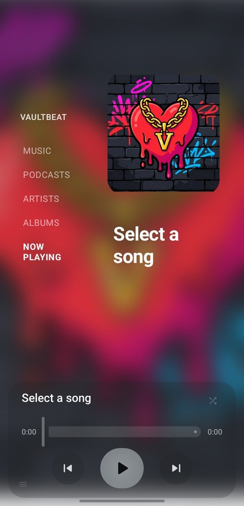
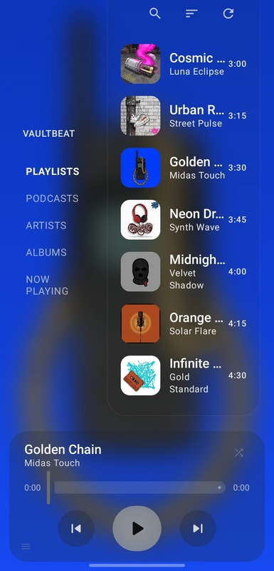

# VaultBeat 🎵

   
  <b>Your music, your rules. A modern, privacy-first local player for Android.</b>
    
  
  
  
  

---

**VaultBeat** is a high-performance, privacy-focused music player built for users who value simplicity and freedom. Manage your local library without trackers, cloud dependencies, or unnecessary bloat.

## ✨ Key Features

- 🎧 **Local First**: Optimized playback for M4A and high-fidelity audio formats.
- 🛡️ **Privacy by Design**: Zero data collection. No telemetry. No internet required for playback.
- 🎨 **Material 3 UI**: A fluid, modern experience built entirely with **Jetpack Compose**.
- 🔍 **Deep Search**: Instantly find any song, artist, or album in your library.
- 📂 **Smart Organization**: Automatic metadata-based categorization.
- 🌐 **Metadata Enrichment**: Fetches high-quality artwork and info from iTunes, MusicBrainz, and Last.fm.
- ⚡ **Powerful Core**: Leverages `yt-dlp` for advanced media handling.

## 📱 Visual Showcase

---

## 🚀 Getting Started

### Prerequisites
- Android device (API 29+)
- Android Studio Ladybug (or newer)

### Installation
1. **Clone**: `git clone https://github.com/roma00001/VaultBeat.git`
2. **Open**: Launch the project in Android Studio.
3. **Build**: Let Gradle sync and hit **Run**.

---

## 🛠️ Built With

VaultBeat uses the latest industry-standard tools:

- **Kotlin** & **Jetpack Compose** for a reactive UI.
- **Media3 (ExoPlayer)** for a robust playback engine.
- **Hilt** for clean dependency injection.
- **Room** & **DataStore** for efficient local storage.
- **MVVM + Clean Architecture** for maintainability.

---

## 🤝 Support the Project!

VaultBeat is an open-source project driven by the community. Your support keeps the development alive!

- ⭐ **Star the Repo**: It helps others discover the project.
- 🐛 **Report Bugs**: Found something wrong? Open an issue!
- 💡 **Suggest Features**: Have a great idea? Let us know.

---

## 🤖 F-Droid Compliance

We are committed to the F-Droid philosophy:
- 100% Free & Open Source (GPLv3).
- No proprietary binaries or trackers.
- All dependencies compatible with F-Droid build standards.

---

## 📄 License & Disclaimer

VaultBeat is released under the **GNU General Public License v3.0**.

*Disclaimer: VaultBeat is intended for personal use and for managing media you have the right to access. Please respect copyright laws.*
